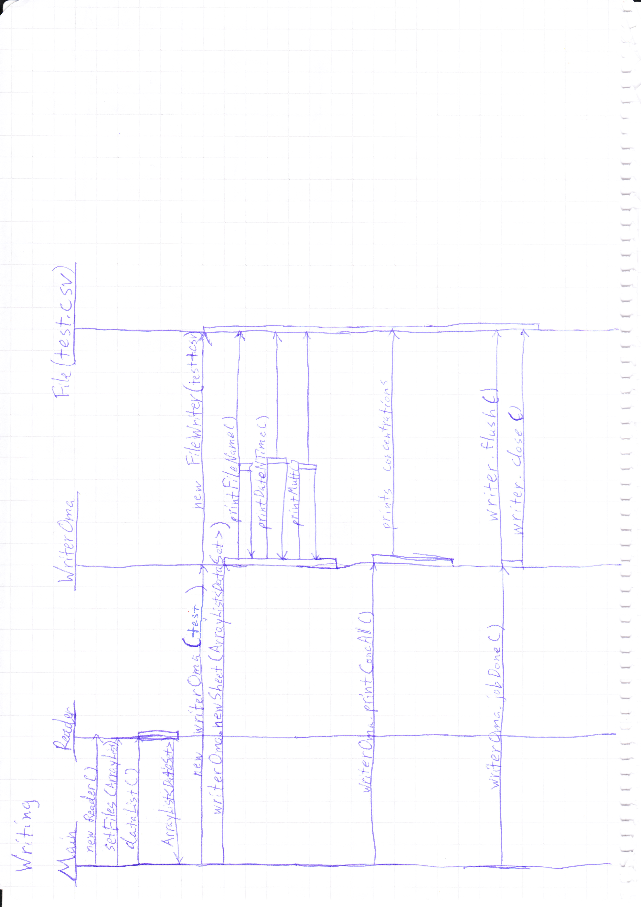
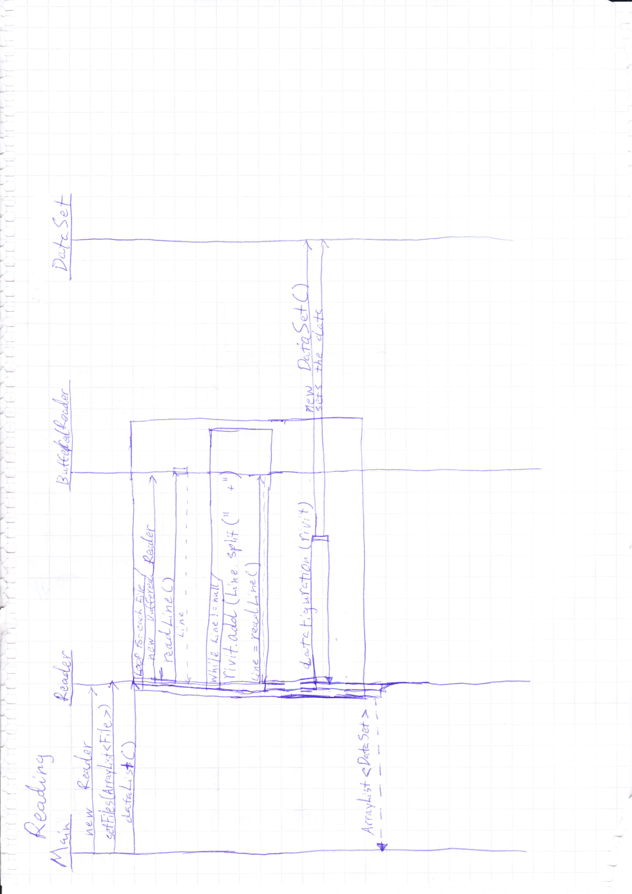

# Converter
Converterin ideana on saada kontaktia sellaiseen ohjelman suunnitteluun jolle koen olevan käyttöä minulle työelämässä. (Sivuaine opiskelija). Ohjelmani loisi valmiin raportin suoraan mittalaitteen raakadasta. Ohjelmaan olisi tarkoitus luoda erilaisia valintoja millainen raportti syntyisi. Ohjelma pystyisi myös tarvittaessa suorittamaan laskentaa ja ihan korjauskertoimen lisäämisestä, laskemaan  tulokset muutettuna eri yksiköihin. Laskennassa voidaan myös ottaa muunto kertoimia esim. annetaan parametreja eri ikkunoihin joiden avulla voidaan laskea korjauskertoimia. Myös pohja graafisille kuvaajille olisi tarkoitus luoda. Tulosten korjauskertoimen liukuma olisi myös tavoitteena. Eli korjaus kertoin liukuisi tai laskettaisiin jokaisen datapisteen kohdalla uudestaan.

Ohjelmalle annetaan käyttöliittymässä kansio tai kansioita. Painaessa starttia ohjelma käy jokaisen kansion läpi ja tarkistaa että sieltä löytyy result.txt tiedosto. Näistä tiedostoista luodaan lista File:jä. Tämä lista annetaan Reader oliolle joka lukee jokaisen tiedoston läpi muodostaen siitä listan listoja jotka sisältää String olioita. Tämän jälkeen jokaisesta tallaisesta String matriisista luodaan DataSet olio keräämällä tarpeellinen tieto niistä. Tämän jälkeen palautetaan lista DataSet olioita WiterOma oliolle. WriterOma kirjoittaa ensin dataFileName, pvm ja multiplierin kaikille näytteille. Tämä johtuu siitä että helpoin tapa kirjoittaa csv file on mennä rivikerrallaan. Kun nämä tiedoston nimet ja muut on kirjattu luetaan dropDown menusta tulostetaanko konsentraatiot vai vasteet. Riville kirjoitetaan kaikista listoista tietty listan alkio. Eli voi syntyä errori jos annetut results.txt filet ovat erilaisia. Suurempi ongelma kuitenkin syntyy jos yhdisteiden lukumäärä on sama mutta ne ovat eri nimillä tai erijärjestyksissä. Ohjelma ei rekisteröi tästä mitään virhettä. On siis itse huomioitava ja varmistettava että results filet ovat samanlaisia (Tällainen ongelma ei pitäisi tulla vastaan ohjelman tarkoitetussa käytössä). 